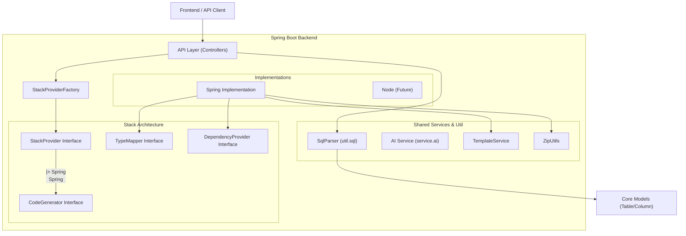
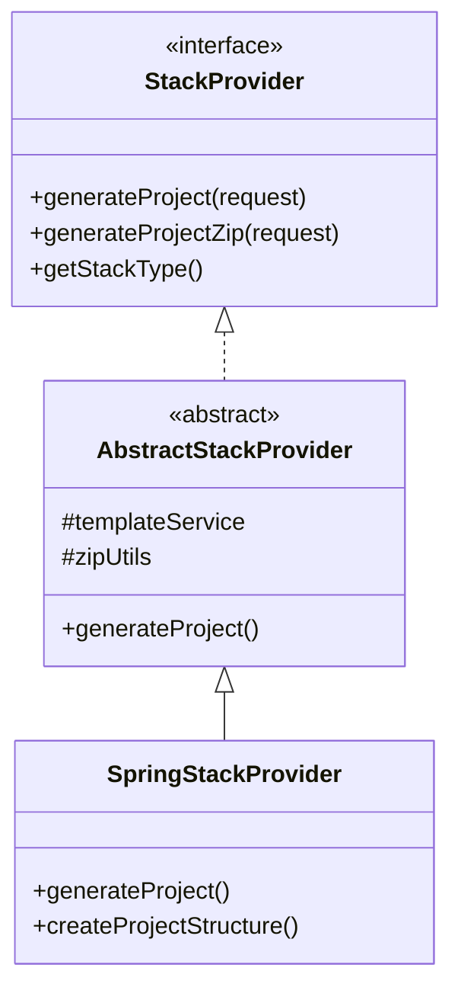
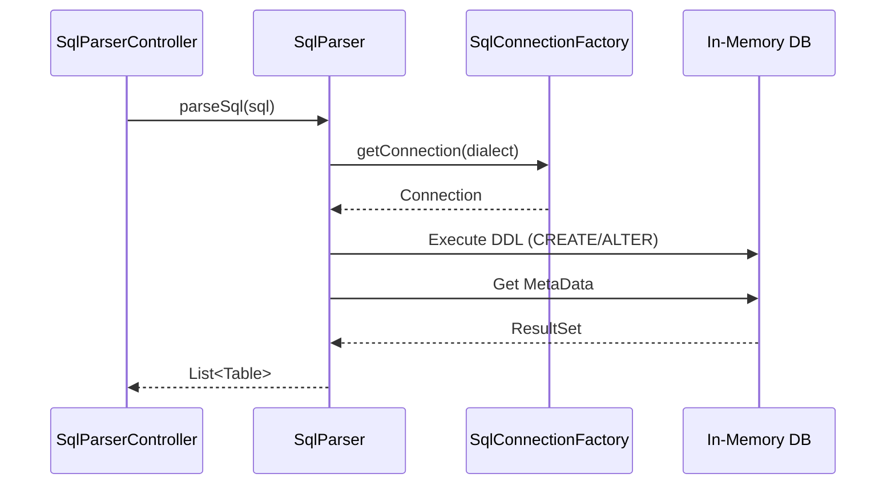

# Multi-Stack Backend Generator - Architecture & Documentation

## Executive Summary

This project is an **extensible multi-stack generator** that transforms SQL schemas into complete, working backend projects. It currently features a robust **Spring Boot** implementation and is designed to support future stacks like Node.js, NestJS, and FastAPI.

The architecture follows a **Strategy Pattern** approach where a core orchestration layer delegates to specific `StackProvider` implementations.

## Architecture Overview

### High-Level Design



## Package Structure (Verified)

The project structure is organized as follows:

```
com.firas.generator/
│
├── config/                            # Global configurations
│   └── FreemarkerConfig.java          # Template engine config
│
├── controller/                        # REST Controllers
│   ├── GeneratorController.java       # Project generation endpoints
│   ├── StackController.java           # Stack discovery endpoints
│   ├── Internal-tools...              # Other controllers
│
├── model/                             # Data Transfer Objects & Domain Models
│   ├── Table.java                     # Database table representation
│   ├── Column.java                    # Column definitions
│   ├── ProjectRequest.java            # Main request payload with stackType
│   └── ... (Dependency classes)
│
├── service/                           # Business Logic
│   ├── TemplateService.java           # Handles FreeMarker processing
│   ├── AIGeneratedTablesService.java  # AI Logic
│   └── ai/                            # AI Provider implementations
│
├── stack/                             # STACK IMPLEMENTATION LAYER
│   ├── StackType.java                 # Enum (SPRING, NODE, NEST, FASTAPI)
│   ├── StackProvider.java             # Core Interface
│   ├── StackProviderFactory.java      # Factory to get correct provider
│   ├── CodeGenerator.java             # Interface for code gen logic
│   └── spring/                        # Spring Boot Specifics
│       ├── SpringStackProvider.java
│       ├── SpringCodeGenerator.java
│       └── SpringTypeMapper.java
│
└── util/                              # Utilities
    ├── ZipUtils.java                  # ZIP file manipulation
    └── sql/                           # SQL Parsing Logic
        ├── SqlParser.java             # Main parser class
        ├── SqlConnectionFactory.java  # Dialect factory
        └── implementation/            # Dialect specific connections
```

## Core Components Detail

### 1. Stack Abstraction Layer (`com.firas.generator.stack`)

This is the heart of the multi-stack system. It defines HOW a stack should behave.

**Key Interfaces:**

*   **`StackProvider`**: The main entry point for any stack.
    *   `generateProject(ProjectRequest)`: Returns a list of files (for IDE preview).
    *   `generateProjectZip(ProjectRequest)`: Returns a downloadable ZIP.
    *   `getStackType()`: logic to identify the stack.
*   **`CodeGenerator`**: Defines how to generate specific components (Entity, Controller, etc.).
*   **`TypeMapper`**: Maps generic SQL types (VARCHAR, INT) to language-specific types (String, Integer).

**Class Diagram:**



### 2. SQL Parser (`com.firas.generator.util.sql`)

The SQL parser is robust and supports multiple dialects interactively. It uses an in-memory database strategy to extract metadata accurately.

**Flow:**
1.  `SqlParser.parseSql(sql, dialect)` is called.
2.  `SqlConnectionFactory` creates a connection (e.g., H2 with MySQL compatibility).
3.  Changes are applied to this in-memory DB.
4.  JDBC Metadata is extracted and converted to `Table` and `Column` models.



## API Reference

### Project Generation

*   **Endpoint**: `POST /api/generate/project`
*   **Description**: Generates and downloads the project ZIP.
*   **Body**: `ProjectRequest`
    *   `stackType`: "SPRING" (default), "NODE", etc.
    *   `tables`: List of parsed tables.
    *   `dependencies`: Selected dependencies.
    *   `springConfig`: Spring-specific settings (groupId, artifactId).

### Stack Discovery

*   **Endpoint**: `GET /api/stacks`
*   **Description**: Lists all available stacks supported by the backend.
*   **Response**: `[{"id":"spring", "displayName":"Spring Boot", ...}]`

### IDE Preview

*   **Endpoint**: `POST /api/generate/preview`
*   **Description**: Returns generated files as JSON for the frontend IDE.
*   **Response**: `ProjectPreviewResponse` containing list of `FilePreview`.

## Design Patterns Used

| Pattern | Implementation | Purpose |
| :--- | :--- | :--- |
| **Strategy** | `StackProvider`, `CodeGenerator` | Swap algorithms based on selected stack. |
| **Factory** | `StackProviderFactory` | Create the correct provider at runtime. |
| **Factory** | `SqlConnectionFactory` | Create correct DB connection for parsing. |
| **Template Method** | `AbstractStackProvider` | Define skeleton of generation, let subclasses fill details. |
