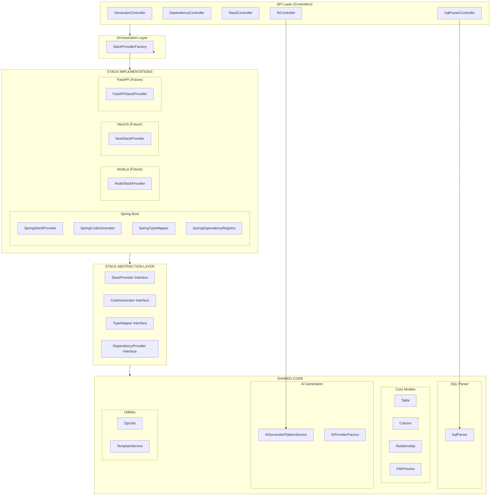
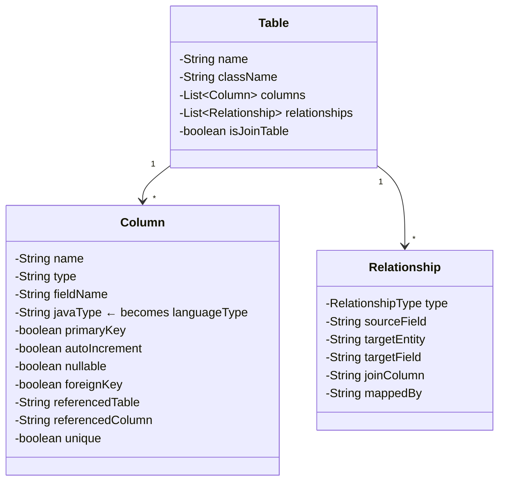
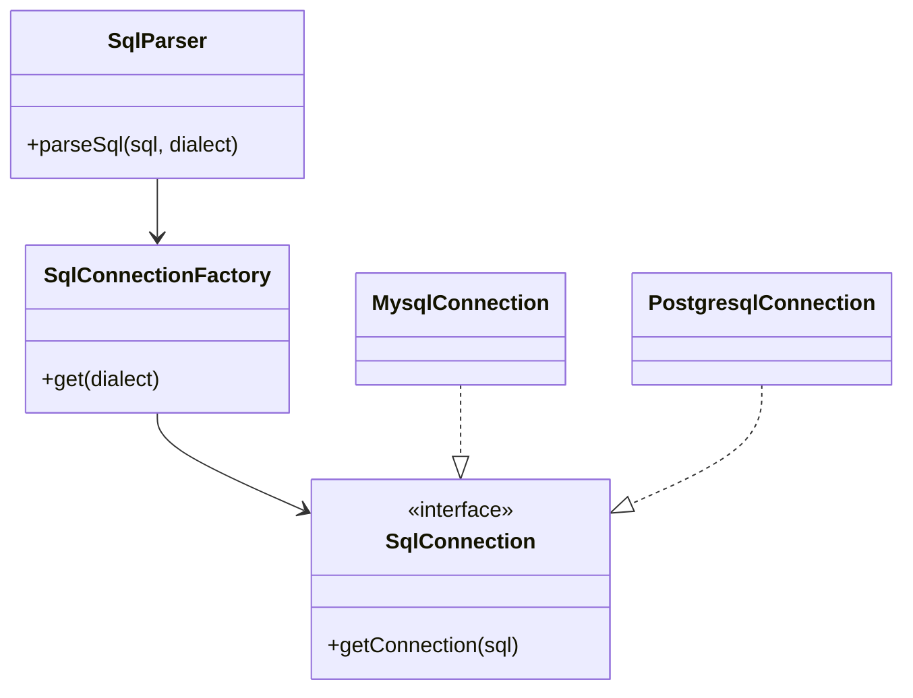
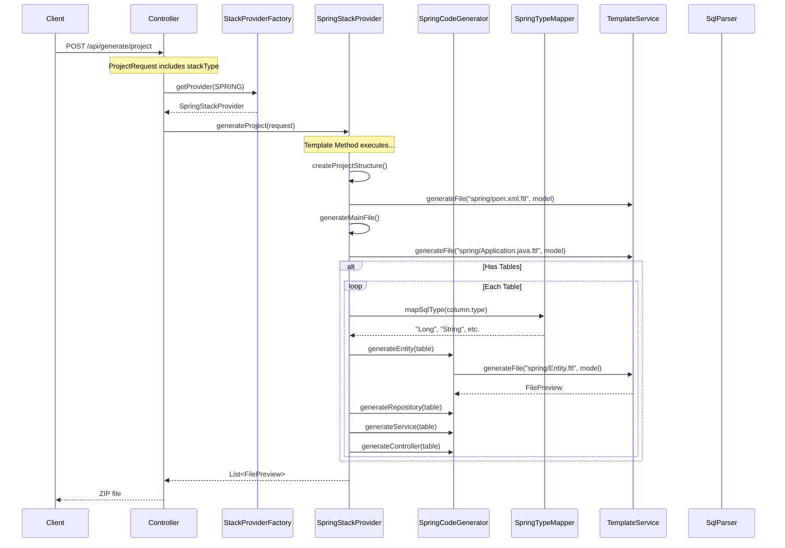

# Multi-Stack Backend Generator - Complete Architecture

## Executive Summary

Transform the Spring Boot generator into an **extensible multi-stack generator** using a **three-layer architecture**:

1. **Shared Core Layer** - Stack-agnostic components (SQL parser, models, AI, utilities)
2. **Stack Abstraction Layer** - Interfaces defining stack provider contracts
3. **Stack Implementation Layer** - Concrete implementations (Spring, Node, Nest, FastAPI)

## Recent Updates (v6)

- **Stack Provider Architecture**: Full refactoring to support multiple stacks.
- **Frontend Integration**: Added Stack Selector and updated API payload structure.
- **Spring Provider**: Isolated as a plugin-like implementation.
- **Documentation**: Comprehensive update for v6 release.

---

## Architecture Overview



---

## Design Patterns Used

| Pattern | Where Used | Purpose |
|---------|------------|---------|
| **Factory** | `StackProviderFactory` | Create stack providers dynamically |
| **Strategy** | `StackProvider`, `CodeGenerator`, `TypeMapper` | Interchangeable algorithms per stack |
| **Template Method** | `AbstractStackProvider` | Common generation workflow with customizable steps |
| **Registry** | `DependencyProvider` | Centralized dependency management |
| **Composition** | `ProjectRequest` | Stack-specific configs (SpringConfig, NodeConfig, etc.) |

---

## Package Structure

```
com.firas.generator/
│
├── core/                              # ═══ SHARED CORE (Stack-Agnostic) ═══
│   ├── model/                         # Data models (unchanged, shared by all)
│   │   ├── Table.java                 # Database table representation
│   │   ├── Column.java                # Column with FK, PK, type info
│   │   ├── Relationship.java          # JPA relationship metadata
│   │   ├── RelationshipType.java      # Enum: ONE_TO_ONE, ONE_TO_MANY, etc.
│   │   ├── FilePreview.java           # Generated file DTO
│   │   └── ProjectPreviewResponse.java
│   │
│   ├── parser/                        # SQL parsing (moved from util/)
│   │   └── SqlParser.java             # Parses SQL → Table/Column/Relationship
│   │
│   ├── ai/                            # AI generation (moved from service/ai/)
│   │   ├── AIGeneratedTablesService.java
│   │   ├── AIProvider.java
│   │   ├── AIProviderFactory.java
│   │   └── providers/
│   │       ├── GoogleADKProvider.java
│   │       ├── OpenAIProvider.java
│   │       └── AnthropicProvider.java
│   │
│   ├── template/                      # Template processing
│   │   └── TemplateService.java       # FreeMarker processor (enhanced)
│   │
│   └── util/                          # Shared utilities
│       ├── ZipUtils.java              # ZIP creation
│       ├── NamingUtils.java           # toClassName(), toFieldName(), plural()
│       └── FileUtils.java             # File I/O helpers
│
├── stack/                             # ═══ STACK ABSTRACTION LAYER ═══
│   │
│   ├── StackType.java                 # Enum: SPRING, NODE, NEST, FASTAPI
│   │
│   ├── StackProvider.java             # Main provider interface (Strategy)
│   ├── CodeGenerator.java             # Code generation interface (Strategy)
│   ├── TypeMapper.java                # Type mapping interface (Strategy)
│   ├── DependencyProvider.java        # Dependency management interface
│   │
│   ├── AbstractStackProvider.java     # Template Method base class
│   ├── AbstractCodeGenerator.java     # Shared generation logic
│   │
│   ├── StackProviderFactory.java      # Factory for providers
│   ├── ProjectBuilder.java            # Builder for project structure
│   │
│   └── spring/                        # ═══ SPRING IMPLEMENTATION ═══
│       ├── SpringStackProvider.java   # Implements StackProvider
│       ├── SpringCodeGenerator.java   # Implements CodeGenerator
│       ├── SpringTypeMapper.java      # Implements TypeMapper
│       └── SpringDependencyProvider.java  # Wraps existing DependencyRegistry
│
├── controller/                        # REST Controllers (mostly unchanged)
│   ├── GeneratorController.java       # Modified: uses StackProviderFactory
│   ├── DependencyController.java      # Modified: accepts stackType param
│   ├── StackController.java           # NEW: list available stacks
│   ├── SqlParserController.java       # Unchanged (uses shared SqlParser)
│   └── AIController.java              # Unchanged (uses shared AI service)
│
├── service/                           # Orchestration services
│   ├── ProjectGeneratorService.java   # Interface (unchanged)
│   └── impl/
│       └── ProjectGeneratorServiceImpl.java  # Delegates to StackProvider
│
├── model/                             # Request/Response DTOs
│   ├── ProjectRequest.java            # Modified: added stackType field
│   ├── DependencyGroup.java           # Unchanged
│   ├── DependencyMetadata.java        # Unchanged
│   └── DownloadRequest.java           # Unchanged
│
└── config/                            # Configuration
    └── FreemarkerConfig.java          # Unchanged
```

---

## Shared Core Components (Detail)

### Core Models (`core/model/`)

These models are **stack-agnostic** and shared by all implementations:



> [!NOTE]
> The `Column.javaType` field currently stores Java types. With `TypeMapper`, this becomes dynamic per stack.

---

### SQL Parser (`core/parser/`)

The SQL Parser has been refactored to support **multiple database dialects** using the **Factory Pattern**.

**Location**: `com.firas.generator.util.sql`

**Architecture**:


**Workflow**:
1. `SqlParserController` receives SQL and `dialect` (default: "mysql").
2. `SqlParser` calls `SqlConnectionFactory.get(dialect)` to obtain the correct `SqlConnection` implementation.
3. The specific implementation (e.g., `MysqlConnection`) creates an in-memory database connection (H2) customized for that dialect.
4. `SqlParser.loadMetadata()` extracts table structure standard JDBC metadata, which remains generic.

**Supported Dialects**:
- **MySQL** (`MysqlConnection`)
- **PostgreSQL** (`PostgresqlConnection`)

**Code Example**:
```java
// Controller usage
public List<Table> parseSql(String sql, String dialect) throws SQLException {
    return sqlParser.parseSql(sql, dialect);
}
```

---

### AI Generation (`core/ai/`)

The AI generation layer is already well-abstracted with the provider pattern. It generates `Table[]` objects that work with any stack.

---

### Template Service (`core/template/`)

Enhanced to support stack-specific template directories:

```java
@Service
public class TemplateService {
    public void generateFile(
        String stackType,        // "spring", "node", etc.
        String templateName,     // "Entity.ftl"
        Map<String, Object> model,
        File outputFile
    ) {
        // Loads from: templates/{stackType}/{templateName}
        Template template = config.getTemplate(stackType + "/" + templateName);
        // ...
    }
}
```

---

## Stack Abstraction Layer (Detail)

### StackType Enum

```java
public enum StackType {
    SPRING("spring", "Spring Boot", "java", "17"),
    NODE("node", "Node.js Express", "javascript", "20"),
    NEST("nest", "NestJS", "typescript", "20"),
    FASTAPI("fastapi", "FastAPI", "python", "3.11");
    
    private final String id;
    private final String displayName;
    private final String language;
    private final String defaultVersion;
    
    // ... constructor and getters
}
```

---

### StackProvider Interface (Strategy Pattern)

```java
public interface StackProvider {
    // Identity
    StackType getStackType();
    String getTemplateDirectory();
    
    // Project generation
    List<FilePreview> generateProject(ProjectRequest request) throws IOException;
    byte[] generateProjectZip(ProjectRequest request) throws IOException;
    
    // Dependencies
    DependencyProvider getDependencyProvider();
    
    // Type mapping
    TypeMapper getTypeMapper();
    
    // Code generation
    CodeGenerator getCodeGenerator();
}
```

---

### AbstractStackProvider (Template Method Pattern)

Defines the **skeleton algorithm** for project generation:

```java
public abstract class AbstractStackProvider implements StackProvider {
    protected final TemplateService templateService;
    protected final ZipUtils zipUtils;
    
    // Template Method: defines generation workflow
    @Override
    public final List<FilePreview> generateProject(ProjectRequest request) throws IOException {
        List<FilePreview> files = new ArrayList<>();
        
        // Step 1: Create project structure (abstract)
        files.addAll(createProjectStructure(request));
        
        // Step 2: Generate build configuration (abstract)
        files.add(generateBuildConfig(request));
        
        // Step 3: Generate main entry point (abstract)
        files.add(generateMainFile(request));
        
        // Step 4: Generate configuration files (abstract)
        files.addAll(generateConfigFiles(request));
        
        // Step 5: Generate CRUD code (common with customizable steps)
        if (request.getTables() != null && !request.getTables().isEmpty()) {
            files.addAll(generateCrudCode(request));
        }
        
        return files;
    }
    
    // Abstract methods for stack-specific implementation
    protected abstract List<FilePreview> createProjectStructure(ProjectRequest request);
    protected abstract FilePreview generateBuildConfig(ProjectRequest request);
    protected abstract FilePreview generateMainFile(ProjectRequest request);
    protected abstract List<FilePreview> generateConfigFiles(ProjectRequest request);
    
    // Common CRUD generation with TypeMapper
    protected List<FilePreview> generateCrudCode(ProjectRequest request) {
        CodeGenerator codeGen = getCodeGenerator();
        TypeMapper typeMapper = getTypeMapper();
        
        // Apply type mapping to columns
        for (Table table : request.getTables()) {
            for (Column col : table.getColumns()) {
                col.setLanguageType(typeMapper.mapSqlType(col.getType()));
            }
        }
        
        // Delegate to CodeGenerator
        return codeGen.generateAllCrud(request);
    }
}
```

---

### CodeGenerator Interface (Strategy Pattern)

```java
public interface CodeGenerator {
    // Entity/Model generation
    FilePreview generateEntity(Table table, String packageName);
    
    // Data access layer
    FilePreview generateRepository(Table table, String packageName);
    
    // Business logic layer
    FilePreview generateService(Table table, String packageName);
    
    // API layer
    FilePreview generateController(Table table, String packageName);
    
    // DTOs
    FilePreview generateDto(Table table, String packageName);
    FilePreview generateMapper(Table table, String packageName);
    
    // Batch generation
    default List<FilePreview> generateAllCrud(ProjectRequest request) {
        List<FilePreview> files = new ArrayList<>();
        for (Table table : request.getTables()) {
            if (request.isIncludeEntity()) 
                files.add(generateEntity(table, request.getPackageName()));
            if (request.isIncludeRepository()) 
                files.add(generateRepository(table, request.getPackageName()));
            // ... etc
        }
        return files;
    }
}
```

---

### TypeMapper Interface (Strategy Pattern)

```java
public interface TypeMapper {
    // Core mapping
    String mapSqlType(String sqlType);
    
    // Common types
    String getIdType();             // Long (Java), number (TS), int (Python)
    String getStringType();         // String, string, str
    String getBooleanType();        // Boolean, boolean, bool
    String getDateType();           // LocalDate, Date, date
    String getTimestampType();      // LocalDateTime, Date, datetime
    String getDecimalType();        // BigDecimal, Decimal, Decimal
    
    // Get all mappings for documentation
    Map<String, String> getAllMappings();
}
```

**SpringTypeMapper Implementation**:

```java
@Component
public class SpringTypeMapper implements TypeMapper {
    private static final Map<String, String> MAPPINGS = Map.ofEntries(
        Map.entry("VARCHAR", "String"),
        Map.entry("TEXT", "String"),
        Map.entry("CHAR", "String"),
        Map.entry("INT", "Integer"),
        Map.entry("INTEGER", "Integer"),
        Map.entry("BIGINT", "Long"),
        Map.entry("DOUBLE", "Double"),
        Map.entry("FLOAT", "Double"),
        Map.entry("DECIMAL", "BigDecimal"),
        Map.entry("BOOLEAN", "Boolean"),
        Map.entry("BIT", "Boolean"),
        Map.entry("DATE", "LocalDate"),
        Map.entry("TIMESTAMP", "LocalDateTime"),
        Map.entry("DATETIME", "LocalDateTime")
    );
    
    @Override
    public String mapSqlType(String sqlType) {
        return MAPPINGS.getOrDefault(sqlType.toUpperCase(), "String");
    }
    
    @Override
    public String getIdType() { return "Long"; }
    // ... other methods
}
```

---

### DependencyProvider Interface

```java
public interface DependencyProvider {
    List<DependencyGroup> getAllGroups();
    DependencyMetadata getDependencyById(String id);
    void refresh();  // Re-fetch dependencies
}
```

---

### StackProviderFactory (Factory Pattern)

```java
@Component
public class StackProviderFactory {
    private final Map<StackType, StackProvider> providers;
    
    @Autowired
    public StackProviderFactory(List<StackProvider> providerList) {
        this.providers = providerList.stream()
            .collect(Collectors.toMap(
                StackProvider::getStackType,
                Function.identity()
            ));
    }
    
    public StackProvider getProvider(StackType stackType) {
        StackProvider provider = providers.get(stackType);
        if (provider == null) {
            throw new IllegalArgumentException("Unsupported stack: " + stackType);
        }
        return provider;
    }
    
    public StackProvider getDefaultProvider() {
        return getProvider(StackType.SPRING);
    }
    
    public List<StackType> getAvailableStacks() {
        return new ArrayList<>(providers.keySet());
    }
}
```

---

## Data Flow Diagram



---

## Modified ProjectRequest

```java
public class ProjectRequest {
    // NEW: Stack selection (defaults to SPRING for backward compatibility)
    private StackType stackType = StackType.SPRING;
    
    // === Common fields (used by all stacks) ===
    private String name;
    private String description;
    private String packageName;          // Base package/module name
    private List<DependencyMetadata> dependencies;
    private List<Table> tables;
    
    // Code generation flags (universal)
    private boolean includeEntity;
    private boolean includeRepository;   // Repository/DAO
    private boolean includeService;
    private boolean includeController;   // Controller/Router
    private boolean includeDto;
    private boolean includeMapper;
    
    // === Spring-specific fields ===
    private String groupId;              // Maven groupId
    private String artifactId;           // Maven artifactId
    private String javaVersion;          // Java version
    private String bootVersion;          // Spring Boot version
    
    // === Future: Node/Nest-specific fields ===
    // private String nodeVersion;
    // private String npmOrYarn;
    
    // === Future: FastAPI-specific fields ===
    // private String pythonVersion;
}
```

---

## API Changes Summary

| Endpoint | Change | Details |
|----------|--------|---------|
| `GET /api/stacks` | NEW | Returns available stacks |
| `GET /api/dependencies/groups` | MODIFIED | Accepts `?stackType=SPRING` |
| `POST /api/generate/project` | MODIFIED | Request body includes `stackType` |
| `POST /api/generate/preview` | MODIFIED | Request body includes `stackType` |
| `GET /api/sqlParser/{sql}` | UNCHANGED | Returns stack-agnostic Table objects |
| `POST /api/ai/generateTables` | UNCHANGED | Returns stack-agnostic Table objects |

---

## Verification Plan

### Unit Tests
```bash
mvn test
```

### API Tests
```bash
# 1. Get available stacks
curl http://localhost:8080/api/stacks

# 2. Get Spring dependencies (explicit)
curl "http://localhost:8080/api/dependencies/groups?stackType=SPRING"

# 3. Get Spring dependencies (default - backward compatible)
curl http://localhost:8080/api/dependencies/groups

# 4. Generate Spring project (explicit stackType)
curl -X POST http://localhost:8080/api/generate/project \
  -H "Content-Type: application/json" \
  -d '{"stackType":"SPRING","groupId":"com.test","artifactId":"demo"}' \
  --output test.zip

# 5. Generate Spring project (no stackType - backward compatible)
curl -X POST http://localhost:8080/api/generate/project \
  -H "Content-Type: application/json" \
  -d '{"groupId":"com.test","artifactId":"demo"}' \
  --output test.zip
```

