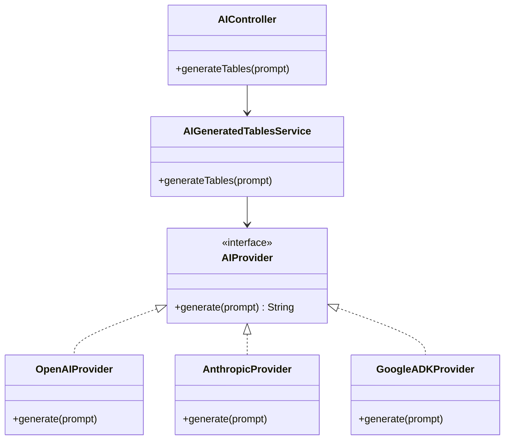
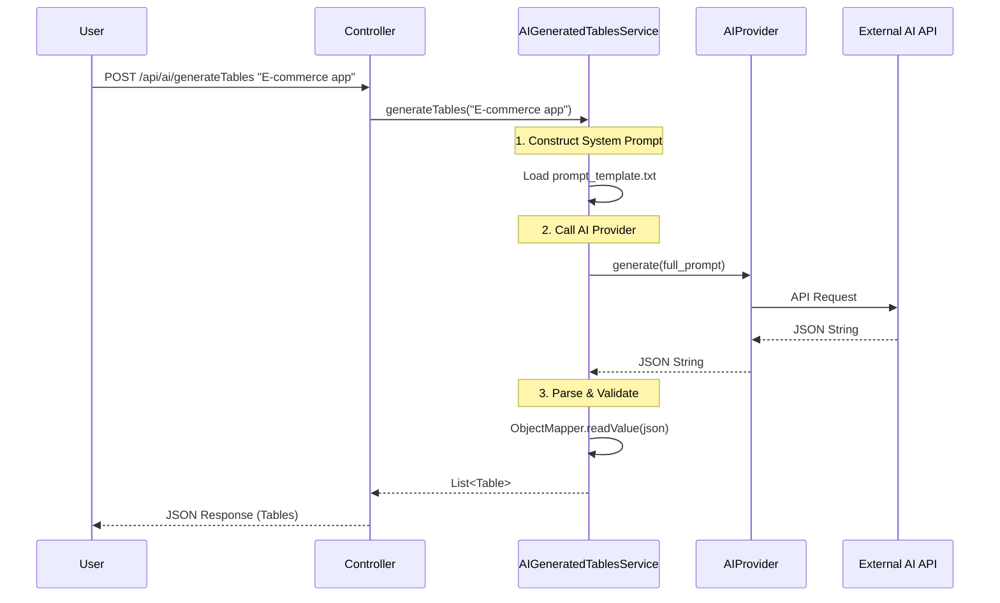

# AI Generation Service

The **AI Service** enables users to generate complete SQL schemas from natural language descriptions (e.g., "Create a school management system"). It abstracts the underlying LLM providers (OpenAI, Anthropic, Google Gemini) to provide a unified interface.

## 🧠 Core Concept

The service translates a user's text prompt into a structured JSON representation of database tables, which is then converted into the application's internal `Table` model.

**Prompt Engineering**: We use a specialized "System Prompt" that forces the LLM to output ONLY valid JSON matching our specific schema structure, ensuring the result is machine-readable without valid parsing.

## 🏗️ Architecture

We use the **Provider Pattern** to support multiple AI backends easily.



## 🔄 Data Flow



## 📝 Configuration

AI providers are configured via `application.properties`. API keys should be set as environment variables for security.

```properties
# Select active provider
app.ai.provider=openai  # openai | anthropic | google

# API Keys
spring.ai.openai.api-key=${OPENAI_API_KEY}
spring.ai.anthropic.api-key=${ANTHROPIC_API_KEY}
google.ai.api-key=${GOOGLE_API_KEY}
```

## 🤖 System Prompt Strategy

The system prompt is critical. It instructs the AI to:
1.  Act as a Senior Database Architect.
2.  Follow strict JSON format.
3.  Include `className`, `columns` with correct SQL types, and `relationships`.
4.  **NEVER** include markdown formatting (like \`\`\`json) in the response, just raw JSON.

**Example JSON Response Expected:**
```json
[
  {
    "name": "users",
    "columns": [
      {"name": "id", "type": "BIGINT", "primaryKey": true},
      {"name": "email", "type": "VARCHAR"}
    ]
  }
]
```
