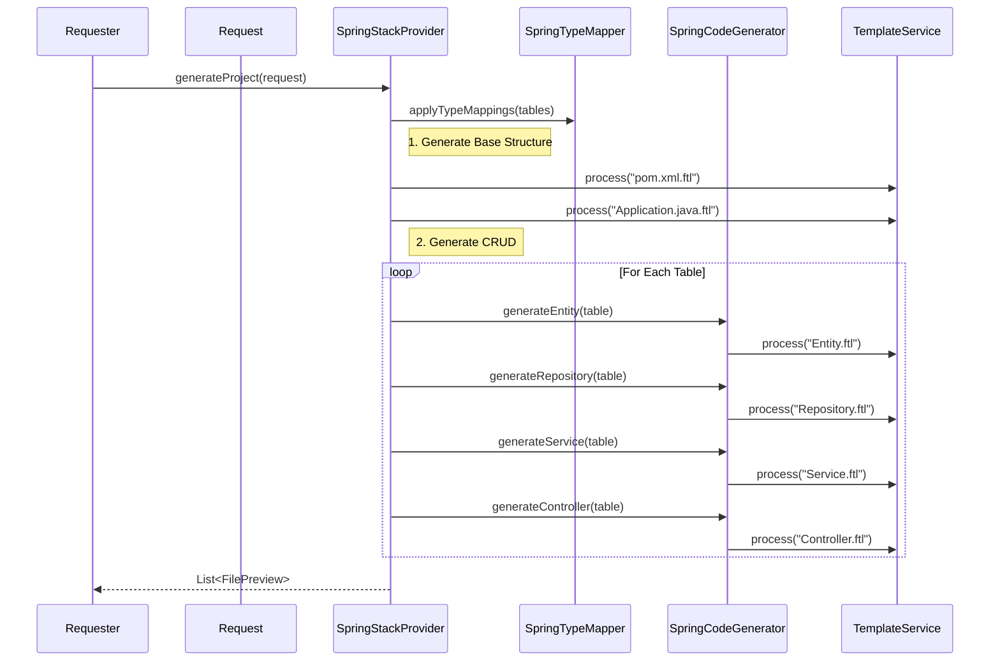

# Spring Stack Provider - Implementation Details

This document details the **Spring Boot** implementation of the generator. It is the reference implementation for the `StackProvider` system.

## 📝 Configuration Fields (`SpringConfig`)

When `stackType` is set to `SPRING`, the `springConfig` object in the request payload controls generation.

| Field | Type | Default | Description |
| :--- | :--- | :--- | :--- |
| `groupId` | String | `com.example` | Maven Group ID (e.g., organization name) |
| `artifactId` | String | `demo` | Maven Artifact ID (project ID) |
| `javaVersion` | String | `17` | Java SDK version (e.g., "17", "21") |
| `bootVersion` | String | `3.2.0` | Spring Boot framework version |
| `buildTool` | String | `maven` | Build system ("maven" or "gradle") |
| `packaging` | String | `jar` | Packaging type ("jar" or "war") |

**Example Payload:**
```json
{
  "stackType": "SPRING",
  "springConfig": {
    "groupId": "com.mycompany",
    "artifactId": "myservice",
    "javaVersion": "21",
    "bootVersion": "3.2.2"
  }
}
```

## 🏗️ Components Structure

### 1. `SpringStackProvider`
**File**: `com.firas.generator.stack.spring.SpringStackProvider`

The main orchestrator. It executes the following flow:
1.  **Type Mapping**: Converts all SQL column types to Java types (e.g., `VARCHAR` -> `String`) using `SpringTypeMapper`.
2.  **Structure Generation**:
    *   Generates `pom.xml` (Maven build).
    *   Generates `Application.java` (Main class).
    *   Generates `application.properties`.
3.  **CRUD Generation**:
    *   Iterates over parsed tables.
    *   Calls `SpringCodeGenerator` to create Entities, Repositories, etc.

### 2. `SpringCodeGenerator`
**File**: `com.firas.generator.stack.spring.SpringCodeGenerator`

Handles the actual content generation for code files using FreeMarker templates.

**Generated Files:**
*   **Entity**: `@Entity`, `@Table`, relationships (`@OneToMany`, etc.), Lombok annotations.
*   **Repository**: Extends `JpaRepository<Entity, ID>`.
*   **Service**: `@Service` class with CRUD methods.
*   **Controller**: `@RestController` with endpoints (`GET`, `POST`, `PUT`, `DELETE`).
*   **DTO**: Data Transfer Object (if enabled).
*   **Mapper**: MapStruct/ModelMapper interface (if enabled).

### 3. `SpringTypeMapper`
**File**: `com.firas.generator.stack.spring.SpringTypeMapper`

Maps standard SQL types to Java types.

| SQL Type | Java Type |
| :--- | :--- |
| `VARCHAR`, `TEXT`, `CHAR` | `String` |
| `INT`, `INTEGER` | `Integer` |
| `BIGINT` | `Long` |
| `DOUBLE`, `FLOAT` | `Double` |
| `DECIMAL` | `BigDecimal` |
| `BOOLEAN`, `BIT` | `Boolean` |
| `DATE` | `LocalDate` |
| `TIMESTAMP`, `DATETIME` | `LocalDateTime` |

### 4. `SpringDependencyProvider`
**File**: `com.firas.generator.stack.spring.SpringDependencyProvider`

Fetches real-time dependency data compatible with `start.spring.io`.
*   **Endpoint**: `/api/dependencies/groups?stackType=SPRING`
*   **Mechanism**: Wraps `DependencyRegistry` to return categorized groups (Web, SQL, Security, etc.).

## 📂 Template System

Templates are stored in `src/main/resources/templates/spring/`.

| Template File | Purpose | Key Variables |
| :--- | :--- | :--- |
| `pom.xml.ftl` | Maven Configuration | `springConfig`, `dependencies` |
| `Application.java.ftl` | Main Entry Point | `className`, `packageName` |
| `application.properties.ftl` | App Config | `port`, `dbConfig` |
| `Entity.ftl` | JPA Entity | `table`, `columns`, `relationships` |
| `Repository.ftl` | Data Access | `entityName`, `idType` |
| `Service.ftl` | Business Logic | `entityName`, `repositoryName` |
| `Controller.ftl` | API Endpoints | `entityName`, `serviceName` |

## 🔄 Generation Process Flow


