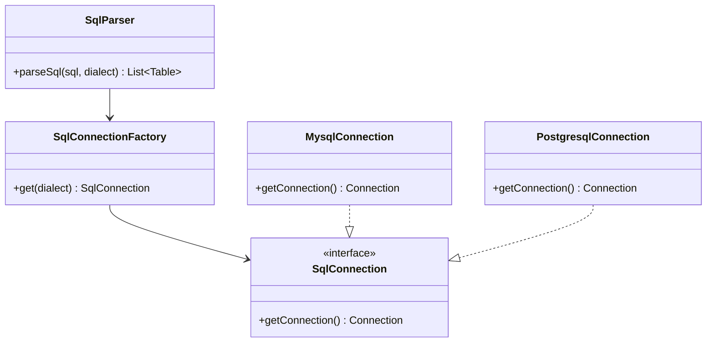
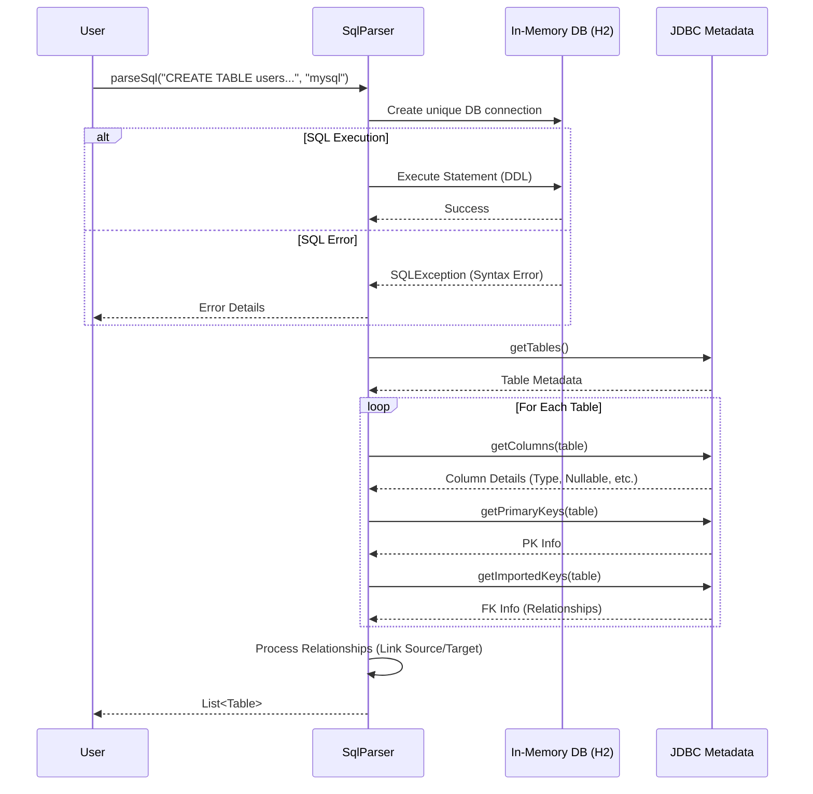

# SQL Parser Component

The **SQL Parser** is a standalone utility component responsible for parsing raw SQL DDL scripts (Data Definition Language) and converting them into the internal object model (`Table`, `Column`, `Relationship`) used by the generator.

## 🚀 Key Features

*   **Multi-Dialect Support**: Parsers for MySQL and PostgreSQL (extensible to others).
*   **In-Memory Execution**: Instead of writing complex regex parsers, we use an in-memory database to "execute" the DDL and then inspect the resulting schema metadata. This ensures 100% accuracy.
*   **Relationship Detection**: Automatically detects Foreign Keys to build `OneToMany` and `ManyToOne` relationships.

## 🏗️ Architecture

The parser uses a **Factory Pattern** to create dialect-specific connections.



## 🔄 Parser Workflow

The `SqlParser` does not parse text manually. It follows this robust flow:

1.  **Create Context**: Spin up an isolated H2 in-memory database instance configured to mimic the target dialect (e.g., `MODE=MySQL`).
2.  **Execute DDL**: Run the user's provided SQL script against this temporary database.
3.  **Inspect Metadata**: Use JDBC `DatabaseMetaData` to query the now-existing tables, columns, and keys.
4.  **Map to Model**: Convert JDBC result sets into our POJOs (`Table`, `Column`).



## 💻 Code Example

**Usage in Controller:**

```java
@Autowired
private SqlParser sqlParser;

public void parse() {
    String sql = "CREATE TABLE users (id INT PRIMARY KEY, name VARCHAR(50));";
    
    try {
        List<Table> tables = sqlParser.parseSql(sql, "mysql");
        // Use tables for generation...
    } catch (SQLException e) {
        // Handle syntax errors
    }
}
```

## 📂 Implementation Details

**Location**: `com.firas.generator.util.sql`

*   **`SqlParser.java`**: Main logic class. Contains the `extractTables` method which does the heavy lifting of mapping JDBC metadata to our domain model.
*   **`SqlConnectionFactory.java`**: Simple switch statement to return the correct connection provider.
*   **`implementation/`**: Contains `MysqlConnection.java` and `PostgresqlConnection.java` which configure the JDBC URL string for H2.

## ⚠️ Known Limitations

*   **H2 Compatibility**: Since we use H2's compatibility modes, some very specific proprietary SQL features of Oracle or SQL Server might not match 100%, though MySQL and Postgres support is excellent.
*   **DDL Only**: The parser focuses on `CREATE TABLE`, `ALTER TABLE`, and other DDL. Data insertion (`INSERT`) is ignored as it doesn't affect schema structure.
