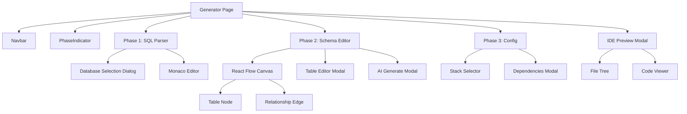
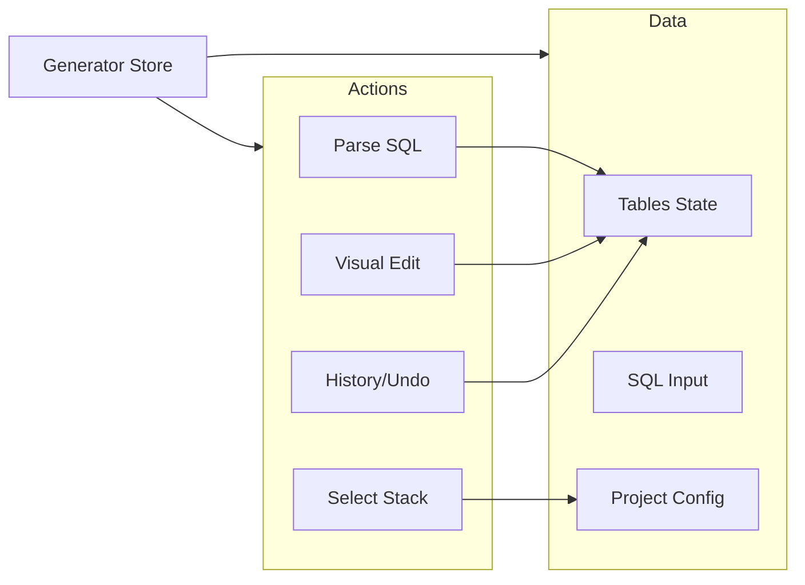

# Spring Generator - Verified Frontend Documentation

## Table of Contents
1. [Overview](#overview)
2. [Architecture Diagrams](#architecture-diagrams)
3. [Project Structure](#project-structure)
4. [Core Features & Components](#core-features--components)
5. [State Management](#state-management)
6. [API Integration](#api-integration)

---

## Overview

The Spring Generator frontend is a **Next.js 15 + React 19** application designed to provide a premium, interactive experience for generating backend projects. It features a 3-phase wizard plus a specialized IDE preview mode.

**Tech Stack**:
- **Framework**: Next.js 15 (App Router)
- **Styling**: Tailwind CSS 4, Radix UI, Framer Motion
- **State**: Zustand 5
- **Visualization**: React Flow (for Schema Editor)

---

## Architecture Diagrams

### Component Hierarchy



### State Management Flow (Zustand)



---

## Project Structure (Verified)

```
frontend/
├── app/
│   ├── generator/page.tsx         # Main Controller
│   └── ...
├── components/
│   ├── generator/
│   │   ├── phase-indicator.tsx
│   │   ├── sql-parser-phase.tsx
│   │   ├── database-selection-dialog.tsx  # DB Selection
│   │   ├── schema-editor-phase.tsx
│   │   ├── table-node.tsx                 # Visualization
│   │   ├── relationship-edge.tsx          # Custom Lines
│   │   ├── table-editor.tsx               # Edit Columns
│   │   ├── ai-generate-modal.tsx          # AI Feature
│   │   ├── project-config-phase.tsx
│   │   ├── stack-selector.tsx             # Multi-stack UI
│   │   ├── dependencies-modal.tsx
│   │   └── code-preview-modal.tsx         # IDE Interface
│   └── ui/                                # Radix Primitives
├── lib/
│   └── store.ts                           # Global State
```

---

## Core Features & Components

### 1. SQL Parser Phase
**Component**: `sql-parser-phase.tsx`
- **Database Selection**: Allows choosing MySQL, PostgreSQL, etc. via `database-selection-dialog.tsx`.
- **Input**: Raw SQL script input.
- **Action**: Calls generic backend SQL parser.

### 2. Visual Schema Editor
**Component**: `schema-editor-phase.tsx`
- **Engine**: React Flow.
- **Interaction**: 
    - **`table-node.tsx`**: Renders custom nodes with columns and types.
    - **`relationship-edge.tsx`**: Renders dynamic connections using "smoothstep" or "bezier".
- **Editing**: `table-editor.tsx` allows deep editing of table properties (PK, FK, Types).

### 3. Stack Configuration
**Component**: `project-config-phase.tsx`
- **Stack Selector (`stack-selector.tsx`)**: 
    - Presents cards for Spring, Node, Nest, FastAPI.
    - Updates `projectConfig.stackType` in store.
- **Dynamic Form**: 
    - Changes input fields based on selected stack (e.g., GroupID for Spring vs Node Version for Node).

### 4. Interactive IDE Preview
**Component**: `code-preview-modal.tsx`
- **Purpose**: Allows users to review the generated code *before* downloading.
- **Features**:
    - **File Explorer**: Tree view of the generated project structure.
    - **Syntax Highlighting**: Uses Monaco Editor for read/write access.
    - **Live Download**: "Download Project" button creates ZIP from currently previewed (and potentially edited) files.
- **API**: Calls `/api/generate/preview` to fetch the initial file set.

---

## API Integration

### Verified Endpoints

| Feature | Method | Endpoint | Payload |
| :--- | :--- | :--- | :--- |
| **Parse SQL** | `GET` | `/api/sqlParser/{sql}` | - |
| **List Stacks** | `GET` | `/api/stacks` | - |
| **Preview** | `POST` | `/api/generate/preview` | `ProjectRequest` |
| **Generate** | `POST` | `/api/generate/project` | `ProjectRequest` |

### Environment Configuration
The frontend connects to the backend using the following environment variable:
```env
NEXT_PUBLIC_BACKEND_URL=http://localhost:8080
```
Usage in Frontend Code:
```env
// Example API call
const backendUrl = process.env.NEXT_PUBLIC_BACKEND_URL;

const response = await fetch(`${backendUrl}/api/generate/preview`, {
  method: 'POST',
  headers: { 'Content-Type': 'application/json' },
  body: JSON.stringify(projectRequest),
});
```
Deployment Considerations:

For local development: http://localhost:8080

For production: Update to your backend's public URL (e.g., https://api.yourdomain.com)

The NEXT_PUBLIC_ prefix makes this variable accessible in the browser


The `ProjectRequest` payload is dynamic. Example for Spring:
```json
{
  "stackType": "SPRING",
  "name": "MyProject",
  "tables": [...],
  "springConfig": {
    "bootVersion": "3.2.0"
  }
}
```
For Node (Future):
```json
{
  "stackType": "NODE",
  "name": "MyProject",
  "nodeConfig": {
    "orm": "prisma"
  }
}
```

## New Store Types

### Architecture & Microservices

```typescript
export type ArchitectureType = "MONOLITH" | "MICROSERVICES"
export type MicroservicesMode = "AUTO" | "MANUAL"

export interface MicroservicesConfig {
  mode: MicroservicesMode
  serviceTableMapping: Record<string, string[]>
  discoveryPort: number
  configPort: number
  gatewayPort: number
  serviceStartPort: number
}
```

Added to `SpringConfig`:
- `architectureType: ArchitectureType` (default: `"MONOLITH"`)
- `microservicesConfig: MicroservicesConfig`

### Frontend Configuration

```typescript
export type FrontendFramework = "NEXTJS" | "ANGULAR" | "REACT"

export interface FrontendConfig {
  enabled: boolean
  framework: FrontendFramework
  port: number
  backendUrl: string
}
```

Added to `ProjectConfig`:
- `frontendConfig: FrontendConfig` (default: `{ enabled: false, framework: "NEXTJS", port: 3000, backendUrl: "http://localhost:8080" }`)

### New Store Actions
- `setFrontendConfig(config: Partial<FrontendConfig>)` - Update frontend config
- `setMicroservicesConfig(config: Partial<MicroservicesConfig>)` - Update microservices config

## New UI Sections

### Architecture Type Selector (project-config-phase.tsx)
When Spring Boot is selected, users can choose between:
- **Monolith** (default) - Single deployable application
- **Microservices** - Multi-module Spring Cloud project with service discovery

When Microservices is selected, a configuration panel shows:
- **Auto mode** - One service per entity, with preview of services to be generated
- **Manual mode** - User-defined service grouping

### Frontend Generation Toggle (project-config-phase.tsx)
A toggle to enable/disable frontend generation with:
- Framework selector: Next.js (active), Angular (coming soon), React (coming soon)
- Description of what will be generated

### Updated Payload Structure
The `getProjectPayload()` function now includes:
- `springConfig.architectureType` and `springConfig.microservicesConfig`
- `frontendConfig` for all stack types
